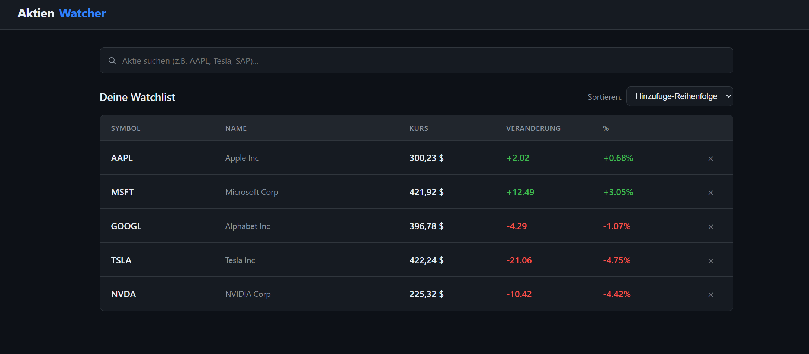
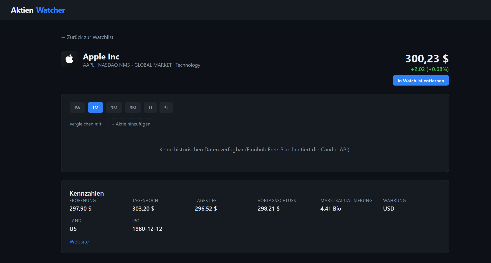

# AktienWatcher

> Eine moderne Aktien-Watchlist-Webanwendung mit Live-Kursen, Charts und Vergleichs-Funktion. Gebaut mit **React 18**, **TypeScript** und der **Finnhub-API**.


---

## Demo

**Live:** https://aktien-watcher-3rub.vercel.app/





---

## Features

- **Watchlist mit Live-Kursen** - Auto-Refresh alle 30 Sekunden, persistent über `localStorage`
- **Sortier-Funktion** - nach Symbol, Name, Kurs oder Tages-Performance
- **Symbol-Suche** mit Autocomplete via Finnhub `/search`
- **Detailseite** mit Unternehmensprofil, Logo und Kennzahlen
- **Interaktiver Chart** mit Zeitspannen 1W / 1M / 3M / 6M / 1J / 5J (Recharts)
- **Aktien-Vergleich** - bis zu zwei zusätzliche Aktien überlagert in einem normalisierten %-Chart
- **Dark Mode** Design im Stil moderner Trading-Apps
- **Responsive** für Desktop und Mobile

---

## Setup

### 1. Repository klonen und Abhängigkeiten installieren

```bash
git clone <repo-url>
cd AktienWatcher
npm install
```

### 2. Finnhub API-Key konfigurieren

Kostenlosen Key holen auf https://finnhub.io/ und in eine neue `.env`-Datei eintragen:

```bash
cp .env.example .env
```

```env
VITE_FINNHUB_API_KEY=dein_echter_key
```

> Hinweis: Vite-Env-Variablen müssen mit `VITE_` beginnen, damit sie im Client verfügbar sind.

### 3. Dev-Server starten

```bash
npm run dev
```

Standardmäßig auf http://localhost:5173

### 4. Production-Build

```bash
npm run build
npm run preview
```

---

## Deployment auf Vercel

Die mitgelieferte `vercel.json` enthält bereits die SPA-Rewrite-Regel.

1. Repo auf GitHub pushen
2. Auf https://vercel.com/new das Repo importieren
3. Environment-Variable `VITE_FINNHUB_API_KEY` im Vercel-Dashboard setzen
4. Deploy klicken

Vercel erkennt Vite automatisch (Build-Command `npm run build`, Output `dist`).

---

## Projektstruktur

```
src/
├── api/
│   └── finnhub.ts              REST-Client für Finnhub (Quote, Profile, Candles, Search)
├── components/
│   ├── SearchBar.tsx           Symbol-Suche mit debounced Autocomplete
│   ├── WatchlistRow.tsx        Eine Zeile der Watchlist (dumb component)
│   ├── StockChart.tsx          Recharts-Wrapper, Single- und Compare-Modus
│   └── CompareControl.tsx      UI zum Hinzufügen/Entfernen von Vergleichs-Aktien
├── hooks/
│   ├── useWatchlist.ts         Watchlist-State + localStorage-Persistenz
│   └── useWatchlistQuotes.ts   Zentralisierte Quote-/Profile-Abfragen
├── pages/
│   ├── WatchlistPage.tsx       Übersicht: Suche + sortierbare Watchlist
│   └── StockDetailPage.tsx     Detail: Header, Chart, Vergleich, Kennzahlen
├── types/
│   └── finnhub.ts              TypeScript-Typen für API-Antworten
├── utils/
│   ├── format.ts               Zahlen-/Währungs-Formatierung (de-DE)
│   └── sort.ts                 Sortier-Logik für die Watchlist
├── App.tsx                     Routing (React Router)
├── main.tsx                    Entry-Point
└── index.css                   Globales Dark-Theme
```

---

## Architektur-Entscheidungen

**Warum React + Vite statt Next.js?**
Für ein clientseitiges Dashboard ohne SEO-Anforderung ist Vite schneller im Dev-Server und liefert einen sehr schlanken Build. Next.js wäre Overkill.

**Warum kein Backend?**
Die Finnhub-API erlaubt CORS-Requests direkt vom Browser. Ein eigenes Backend wäre nur nötig, wenn der API-Key geheim bleiben müsste — auf einer öffentlichen Demo ist das aber so oder so nicht zu verhindern. Für ein echtes Produkt würde man einen Proxy + Rate-Limiting davor schalten.

**Warum Recharts und nicht D3?**
Recharts liefert deklarative React-Komponenten mit gutem Default-Styling. D3 wäre flexibler, aber für Linien-/Flächen-Charts klarer Overkill.

**Warum kein State-Management-Library?**
Der State ist überschaubar: Watchlist (3-10 Symbole) + UI-Filter. React-Hooks reichen. Redux/Zustand wäre Premature Optimization.

---

## Bekannte Einschränkungen

- **Finnhub Free-Plan** limitiert die `/stock/candle`-Endpoint stark. Wenn keine
  Daten geliefert werden, zeigt der Chart eine entsprechende Meldung statt zu
  crashen.
- **Kurse haben 15-Min-Verzögerung** auf dem Free-Plan.
- **Nur US-Aktien** sind auf dem Free-Plan zuverlässig abrufbar (NASDAQ/NYSE).

---

## Tech Stack

| Bereich           | Technologie             |
|-------------------|-------------------------|
| Framework         | React 18                |
| Sprache           | TypeScript 5            |
| Build-Tool        | Vite 5                  |
| Routing           | React Router 6          |
| Charts            | Recharts                |
| API               | Finnhub REST API        |
| Hosting (geplant) | Vercel                  |

---

## Lizenz

MIT - Persönliches Lernprojekt im Rahmen des Bewerbungsportfolios.
